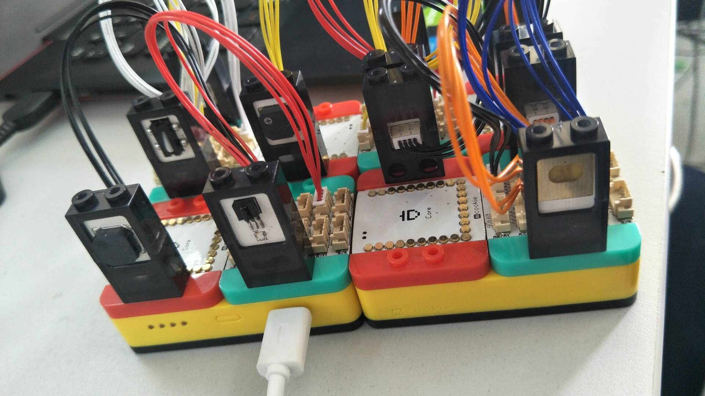

# Arduino
##1、触摸开关，触摸蜂鸣器叫（许门旺）

##2、温度传感器，检测温度发串口调试（许门旺）

##3、人体红外传感器，结合蜂鸣器报警，提示水杯位置（赵慧敏）

##4、遥控红外接收传感器，结合蜂鸣器报警，提示水杯位置（郑朗）

##5、灰度传感器，结合蜂鸣器，帮助盲人壁障（赵慧敏、邵俊祺）

##6、声音传感器，结合蜂鸣器播放音乐（胡广洋、宋昌蔚）

##7、功能结合，2、3、5的融合（郑朗、许门旺）

##8、定时音乐播放，定时提醒喝水（许门旺）

# Funsion360
##1、3D打印杯子外形设计（宋昌蔚）

##2、3D打印杯子底座，智能模块封装（宋昌蔚）

##3、3D打印实体跟进（宋昌蔚）

